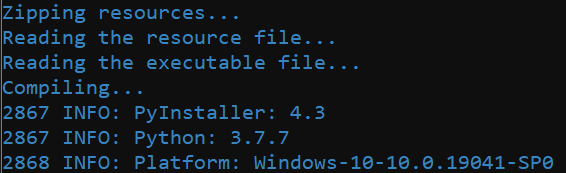

# LionPacker 
#### Simple packer/installer for executables with dependencies
Usage 
```
python lionpacker.py -f [executable_path] -d [dependency_folder_path] -i [target_installation_directory] -c -e -upx [upx_path]
```
<br>
</img><br>
Note: not intended for malware, it doesn't even have runpe in order to avoid false av detections and current version drops the executable unencrypted
```
TODO:
Graphical user interface option in form of an installer
Dynamic decryption & encryption
```
